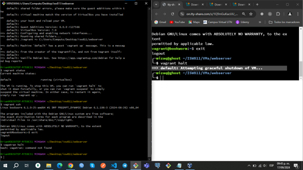

# Workshop 01 - Virtualización - Brian Laguna

## Aplicaciones Instaladas
`1-` Se instala Vc_redistx64.exe  
`2-` Se instala VirtualBox  
`3-` Se instala la extensión de virtualBox  
`4-` Se instala vagran  
`5-` Se instala nodepath.  
`6-` Se instala Gitbash 

## Comandos para sobrevivir en Bash Linux
`pwd` : Imprimir el Directorio actual.  
`cd` : Cambiar de directorio.  
`mkdir` : Crear un directorio.  
`touch` : Crear un archivo en vacío.  
`ls` : Listar el directorio actual.  
`ls -a` Listar el directorio actual, incluyendo archivos ocultos.   

## Aprovisionar máquina Debian Bookworm
./ hace referencia al archivo actual.  
../ se refiere al otro archivo fuera de la carpeta.    
Se ejecutaron varios comandos para logar instalar la máquina virtual en virtual box
vagrant,vagrant status, vagrant halt, code Vafrandfile, vagrant up.  
El ultimo comando es el que termina de crear la máquina virtual, la cual podremos ver en la aplicación.
de virtual box.  
Se le cambia la ip a la máquina virtual en la línea #35 config.vm.network "private_network", ip: "192.168.56.10"

## Extensión Markdown PDF
`1-` Se instala la extensión Markdown PDF en VS Code.  
`2-` Se coloca >pdf en la barra de búsqueda para guardar en pdf el readme.  
`3-` Para los saltos de línea le damos dos espacios.    
  
## Enlace repositorio git
[Workshop#1](https://github.com/Brian1522/ISW-811.git) 
  
## Evidencia de Trabajo Terminado Correctamente.

### Comando de Git Bash

### Máquina Virtual instalada en VirtualBox

