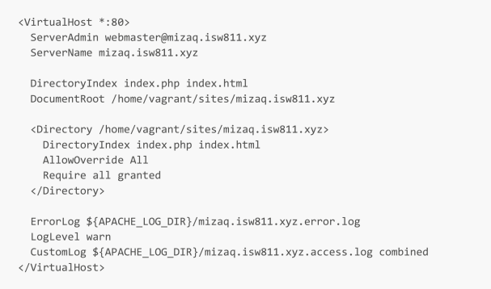
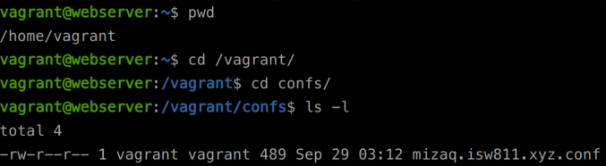
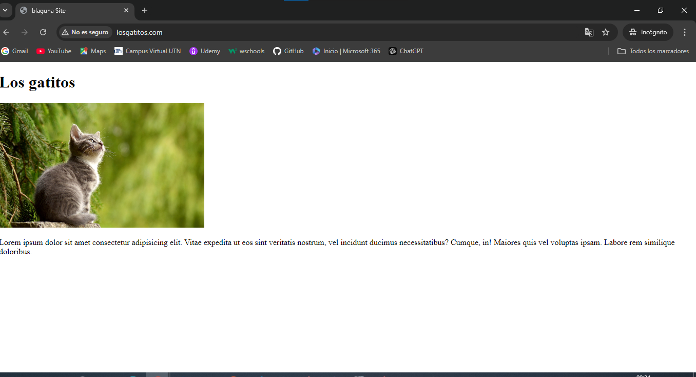
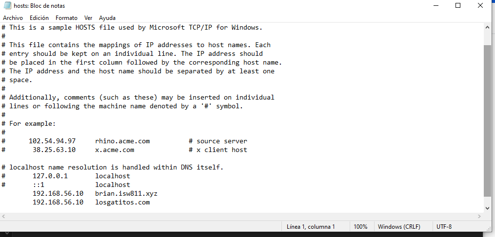

# Workshop 02 - Implementación de LAMP en Bookworm - Brian Laguna

## Cronograma del Workshop
`1-` Cambiar el hostname de la máquina virtual.  
`2-` Instalación de paquetes Debian requeridos para el servidor.  
`3-` Configuración de entrada a el hostfile. 
`4-` Preparar el servidor para hospedar sitios.  
`5-` Configurar la sincronización en 2 vías de vagrant.  
`6-` Configurar el primer host.  
`7-` Creación de página web losgatitos.com.  
`8-` Visualización de la página web desplegada en el servidor creado.  

## Comandos para crear el servidor desde el git Bash
`vagrant up` : Enciende la máquina virtual.  
`vagrant ssh` : Accede a la máquina virtual.  
`sudo hostnamectl set-hostname webserver` : Cambia el nombre de a la máquina virtual y se le coloca webserver.  
`host file` : Simula un nombre a una ip como un DNS.  
`sudo nano /etc/host` : Edita el archivo y cambia el archivo a bookworn.  
`ls -a` : Listar el directorio actual, incluyendo archivos ocultos.  
`Ctrl + o` : Colocamos ctrl + o  para guardar y enter para confirmar que vamos a guardar el archivo.   
`Ctrl + x` : Colocamos ctrl + x para salir de la ventana donde estamos editando.  
`exit` : Ejecutamos exit para salir de la ventana y ejecutamos vagrant up, para reiniciar la maquina  
nuevamente. y también ejecutamos `vagrant ssh`.  
`sudo apt-get update` : Actualizamos la lista de paquetes elegibles.   
`sudo apt-get install vim vim-nox curl apache2 mariadb-server mariadb-client php8.2 php8.2-curl php8.2-bcmath php8.2-mysql php8.2-mcrypt php8.2-xml php8.2-zip php8.2-mbstring` : Instalamos todos los paquetes necesarios para el servidor.  
`ping 192.168.56.10` : Hacemos ping desde la maquina anfitriona a la virtual con esto comprobamos que haya conexión a la máquina virtual.  
`c:\windowns/system32\drivers\etc\` : Abrimos esa ruta en el cmd de la maquina anfitriona, nos llevara a un archivo llamado hosts.  
`sudo nano /etc/hosts` : Nos abrirá el archivo y le agregaremos los dominios.  
`192.168.56.10` hacia el servidor `blaguna.isw811.xyz`.  
`192.168.56.10` hacia el servidor `losgatitos.com` : Guardamos y cerramos.  
`ping blaguna.isw811.xyz` : Hacemos ping para comprobar que el dominio este habilitado.
`http://blaguna.isw811.xyz` : Abrimos esa dirección en pestaña en modo incognito si la podemos visualizar significa que está bien el dominio.  
`sudo a2enmod vhost_alias rewrite ssl` : Instalamos `rewrite` que es un módulo requerido por Frameworks como laravel.  
`sudo systemctl restart apache2` : Reiniciamos el servicio de ejecución.  
`config.vm.syscend_folder "sites","/home/vagrant/sites", owner: "www-data", group:"www-data"`: Des de la maquina anfitriona editaremos el vagrantfile en el directorio `/home/vagrant/sites`.  
`Crear sites` : Creamos la carpeta sites, `mkdir sites`, `vagrant halt`, `vagrant up`, `vagrant ssh`.  
`vagrantfile`: Nos colocamos a nivel de la carpeta `vagrantfile`.  
`confs` : Desde la maquina anfitriona ejecutamos los comandos `mkdir confs`, `cd confs`, `touch blaguna.isw811.xyz.conf`.  
`code blaguna.isw.xyz.conf` : Desde VScode en el archivo `blaguna.isw.xyz.conf` agregamos  
  
`/vagrant/confs` : Volvemos a la máquina Virtual y nos colocamos en `/vagrant/confs` y ejecutamos `pwd`, `cd /vagrant`,
`cd confs` `ls -l`. Visualizamos el archivo.   
Copiamos el archivo `/vagrant/confs` a `/etc/apache2/sites-available/` con el comando  `sudo cp blaguna.isw811.xyz.conf /etc/apache2/sites-available/`.  
`sudo a2ensite blaguna.isw.xyz.conf` : Habilitamos el sitio.  
`sudo apache2ctl -t` : Verificamos que no haya errores. Si aparece `Syntax OK` reiniciamos la máquina virtual,  `sudo systemctl restart apache2`.  

`El error no fue solucionado en clase`

## Comandos en el cmd como administrador
`cd drivers\etc` : nos colocamos en la carpeta etc.  
`cd drivers\etc\nodepad host` : Este comando nos abrirá un archivo al cual debemos de agregarle esta ruta  
192.168.56.10   brian.isw.xyz. 192.168.56.10 losgatitos.com
`ping 192.168.10` : Hacemos ping a la maquina vitual con esa ip y este debería de ser correcto.  

## Teclas rápidas.  
`Ctrl + o` : Se utiliza para guardar y enter para confirmar que vamos a guardar el archivo.  
`Ctrl + x` : Se utiliza para salir de la ventana donde estamos editando.
`tab o tabulador` : Nos ayuda a terminar la palabra esto para evitar errores de escritura.

  
## Enlace repositorio git
[Workshop#2](https://github.com/Brian1522/ISW-811.git) 
  
## Evidencia de Trabajo Terminado Correctamente.

### Archivo host con urls de pagina web.  
  

### Sito web losgatitos.com, corriendo en el servidor.

